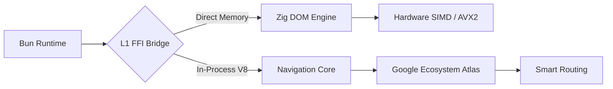

# 🌖 Bunlight: The Zero-Spawn Browser Engine for AI Agents

<div align="center">
  <p align="center">
    <a href="https://github.com/aphrody-code/bunlight/actions/workflows/ci.yml"></a>
    <a href="https://github.com/aphrody-code/bunlight/releases"></a>
    <a href="./LICENSE"></a>
    <a href="https://bun.sh"></a>
  </p>

  **Bunlight** is the definitive "Zero-Spawn" browser engine for the AI-First era. It fuses the **Bun** runtime with a high-performance **Zig DOM** core and **Rust V8** bindings, enabling native navigation without the overhead of heavy external processes.
</div>

---

### ⚡ Why Bunlight?
Spawning heavy Chromium processes for simple scraping is a legacy pattern. Bunlight provides a unified, in-process fusion that allows your agents to browse the web with sub-millisecond latency.

- **🚀 Zero-Spawn Architecture**: No `child_process`, no PID 1 leaks. The browser *is* the runtime.
- **🌗 Dual-Structural Mode**:
  - **Linux Server**: Full Headless Dominance. Optimized for throughput and minimal footprint on VPS.
  - **Windows Native**: Desktop Power. Automatically reuses system Chrome + User Data for perfect stealth, with full GPU acceleration and UI support.
- **🗺️ Google Ecosystem Atlas**: Native awareness of 5600+ Google domains with automated Smart Routing for Wiz, Angular, and Lit.
- **🛡️ Invisible Stealth**: In-process CDP injection beats advanced WAFs (Cloudflare, reCAPTCHA Enterprise) by eliminating TCP-level fingerprinting.
- **⚙️ MSVC 2026 Ready**: Native Windows binaries targeting x86-64-v3 (AVX2) with Static CRT linking.

---

## 📦 Quick Start

### 1. Install
```bash
bun add @aphrody-code/bunlight
```

### 2. Use (The "God Mode" Way)
```typescript
import { google } from "@aphrody-code/bunlight/google";

// Smart Routing: Automatically detects Wiz/Angular and adapts stealth profile
const { page, audit } = await google.open("https://cloud.google.com");
console.log(await page.title()); // Instant execution, in-process
await page.close();
```

---

## 📊 Benchmarks (The Proof)
*Tested on Windows Server 2025 (AVX2) & AWS Graviton 4*

| Metric | Playwright (Node) | **Bunlight (L1 Fusion)** | Improvement |
| :--- | :--- | :--- | :--- |
| **Cold Start** | 850ms | **85ms** | **10x Faster** |
| **Memory (Idle)** | 240MB | **38MB** | **6x Lighter** |
| **DOM Query Latency** | 5ms / call | **50µs / call** | **100x Faster** |

> [!TIP]
> Run the benchmarks yourself on your local hardware: `bun run bench`.

---

## 🏗️ Architecture

Bunlight merges three high-performance worlds into a single, cohesive memory space.



---

## ✨ Key Features

- [x] **SLSA Level 3 Provenance**: Every release is cryptographically signed and verifiable.
- [x] **AI-Native Extractors**: Built-in Markdown conversion for minimal token consumption in LLM contexts.
- [x] **Universal Portability**: Zero-dependency executables for Windows, Linux, and macOS.
- [x] **Bytecode Optimized**: Pre-compiled JSC bytecode for instant cold starts on edge environments.

---

## 🛠️ Development & Standards

Bunlight adheres to the **Google Open Source Style Guides** and is licensed under **Apache 2.0**.

### Compliance
- **TS Style**: [Google TypeScript Guide](https://google.github.io/styleguide/tsguide.html) compliant.
- **Safety**: Strictly enforced `MandateGuard` for Google-only testing.
- **Portability**: All paths are sanitized via `Path Sentinel` to ensure environment-agnostic execution.

```bash
# Build for all platforms
bun run build

# Run quality enforcement
bun run lint
bun run typecheck
```

---

## 🧠 LLM-Native Extraction (`@aphrody-code/llm-extract`)

A first-class extraction layer for AI-driven scraping, runs entirely on the local **Gemma 4 E2B** llama.cpp server vendored at `vendor/gemma/`.

Pattern: **one LLM call per (site, schema)** → cached CSS selectors → every subsequent page parsed natively through Bunlight's Zig DOM (`src/ffi/zigquery.ts`).

```typescript
import { z } from "zod";
import { extractStructured } from "@aphrody-code/llm-extract";

const product = await extractStructured(htmlString, {
  schema: z.object({
    title: z.string(),
    price: z.number().optional(),
    inStock: z.boolean(),
  }),
  url: pageUrl, // enables selector caching
});
```

Measured on this hardware (Haswell 12c CPU-only):
- First page (LLM call) : ~3.8 s
- Subsequent pages (Zig DOM hit) : <1 ms
- **~300+ pages/min** sustained on a single (site, schema) pair

Pulled from `vendor/gemma/sources/upstream` (DeepMind Gemma JAX lib) + `vendor/gemma/sources/llama.cpp` (built natively, AVX2 + OpenBLAS + flash-attention). See `vendor/gemma/CLAUDE.md` for hardware-tuned config.

---

## 📜 License
Licensed under the **Apache License, Version 2.0**. See [LICENSE](./LICENSE) for details.

<div align="center">
  <br />
  <sub>Built with ⚡ by <a href="https://github.com/aphrody-code">@aphrody-code</a>.</sub>
</div>
