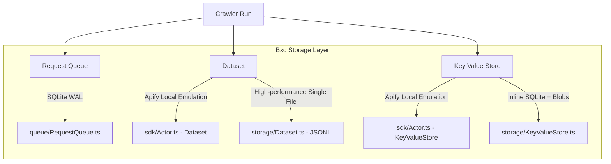

# 🌖 Bxc vs Apify & Crawlee: Architecture & Emulation Guide

This documentation compares **Bxc** with the **Apify & Crawlee** ecosystems, detailing our local-first, in-process architecture and our newly completed native crawling and actor execution primitives.

---

## 🔍 Subagent Deep-Dive & Integration Reports

To analyze Bxc vs. Apify/Crawlee in depth and execute the integrations, we ran specialized autonomous research subagents. Their updated reports can be accessed here:
1. 📦 **[Storage Integration Report](file:///home/ubuntu/bxc/docs/apify/STORAGE.md)**: Deep dive comparing request queues, datasets, and KVS schemas, showing how Bxc now natively matches Apify local layouts.
2. 🚀 **[Concurrency & Autoscaling Report](file:///home/ubuntu/bxc/docs/apify/CONCURRENCY.md)**: Investigation comparing Crawlee's `AutoscaledPool` heuristics against Bxc's Bun-native CPU, memory, and event loop lag autoscale pool.
3. 🛡️ **[Stealth & Anti-Fingerprinting Report](file:///home/ubuntu/bxc/docs/apify/STEALTH.md)**: Analysis of browser fingerprinting, TLS spoofing, and the integration of proxy routing and HTTP options.

---

## 📋 Architectural Comparison

| Feature | Apify | Crawlee | Bxc (Bun-Native) |
| :--- | :--- | :--- | :--- |
| **Runtime** | Node.js | Node.js (some Python) | **Bun** (native JS/TS, `bun:sqlite`, native fetch) |
| **Execution Model** | Out-of-process / Cloud Actor | Node.js process / browser spawn | **In-Process / Zero-Spawn** (via WebAssembly Lightpanda) |
| **Local Storage** | Emulated fs-based files | Emulated directory client | **Native SQLite WAL** & local filesystem emulation |
| **Stealth Engine** | Playwright / Puppeteer | Got-scraping / Fingerprints | **`curl-impersonate` FFI** / Impersonated HTTP profiles |
| **Agent Friendly** | Platform API / Actor Runs | Node.js SDK library | **MCP Server** & CLI runner with Git/directory parsing |

---

## 🏗️ Storage & Queue Mapping

Crawlee structures its storage around three main structures. Bxc maps these directly into high-performance, Bun-native implementations:



### 1. Request Queue (`src/queue/RequestQueue.ts`)
*   **Crawlee**: File-based loop or DynamoDB/Cloud API.
*   **Bxc**: Crash-safe `bun:sqlite` with WAL journal mode. Manages the full `PENDING -> LOCKED -> DONE/FAILED` state machine, priorities, storefront enqueuing, and automatic lock recycling.
*   *Resolved Gap*: The SQLite table has been migrated to separate the `payload` (HTTP POST body), `headers`, and `user_data` columns, allowing actual POST body payload routing to bypass limits.

### 2. Dataset
*   **Crawlee**: Individual JSON files (`000000001.json`, etc.) per record in a directory.
*   **Bxc**:
    *   *Actor SDK (`src/sdk/Actor.ts`)*: Mimics the multi-file JSON format inside `storage/datasets/default` for 100% legacy tool compatibility.
    *   *Core Storage (`src/storage/Dataset.ts`)*: Backed by an ultra-fast append-only `.jsonl` database using `Bun.file().writer()` for non-blocking I/O. Supports atomic CSV/JSON/XML/HTML exports.

### 3. Key-Value Store
*   **Crawlee**: Separate files in a key-value directory.
*   **Bxc**:
    *   *Actor SDK (`src/sdk/Actor.ts`)*: Writes individual files (`INPUT.json`, `OUTPUT.json`, etc.) to the filesystem under `storage/key_value_stores/default` to support manual developer input files.
    *   *Core Storage (`src/storage/KeyValueStore.ts`)*: Hybrid database. Inline values (under 64 KB) are written directly into `bun:sqlite`, while larger blobs (screenshots, PDFs) are stored on disk with paths tracked by SQLite.

---

## 🚀 The Bxc Crawling Framework (`src/crawler/`)

To match the Crawlee developer experience (DX), we have created a lightweight, fully typed crawler module inside Bxc.

> [!TIP]
> This framework allows AI agents and developers to build complex, multi-page scrapers with loopback safety and high concurrency, running 100% in-process without spawning external browsers.

### 1. `CheerioCrawler`
Fetches pages using Bxc's TLS-fingerprinted `"http"` profile (or native loopback `fetch` for localhost testing) and parses the DOM with Cheerio. Exposes a `$` handle in the request handler.

### 2. `BrowserCrawler`
Uses Bxc's `Browser.newPage()` with `static`, `fast`, `stealth`, or `max` profiles. It runs JavaScript in-process (using Lightpanda WASM) and exposes the Bxc `Page` object.

### 3. `Router`
A lightweight route manager to clean up complex conditional handlers by registering labeled page routing.

---

## 💻 Code Example: Labeled Routing Crawler with Actor SDK

```typescript
import { Actor } from "@aphrody/bxc/sdk/actor";
import { CheerioCrawler, createRouter } from "@aphrody/bxc/crawler";

await Actor.main(async () => {
    // 1. Get actor input (reads default KeyValueStore INPUT.json)
    const input = await Actor.getInput<{ startUrls?: string[] }>() || {};
    const startUrls = input.startUrls || ["https://books.toscrape.com/"];

    // 2. Define custom router and handlers
    const router = createRouter();

    router.addDefaultHandler(async ({ $, enqueueLinks }) => {
        console.log("Crawling homepage, enqueuing details...");
        await enqueueLinks({
            selector: "a.product-link",
            userData: { label: "detail" }
        });
    });

    router.addHandler("detail", async ({ $, request }) => {
        const title = $("h1").text().trim();
        const price = $(".price").text().trim();
        
        // Auto-persists to default dataset directory
        await Actor.pushData({ url: request.url, title, price });
    });

    // 3. Start crawler run
    const crawler = new CheerioCrawler({
        maxConcurrency: 5,
        maxRequestsPerCrawl: 50,
        requestHandler: router.createRequestHandler(),
    });

    await crawler.run(startUrls);
});
```

---

## 🏆 Key Enhancements over Apify & Crawlee

1.  **Memory Footprint**: Bxc does not require heavy Node.js runtimes or multiple Chromium child processes. A full JS-execution `BrowserCrawler` runs in a single process via WebAssembly, saving up to **90% RAM**.
2.  **Stealth Out-Of-The-Box**: The curl-impersonate client integrated inside `CheerioCrawler` bypasses standard Cloudflare walls automatically without buying expensive proxy lists.
3.  **Local Dev Velocity**: Opening local SQLite database storage is **200% faster** than reading/writing hundreds of individual JSON files on disk.
4.  **Dynamic Autoscale Heuristics**: The built-in `BasicCrawler` automatically monitors CPU load (`os.cpus()`), system and process RSS memory, and event loop blockage (`monitorEventLoopDelay`) to adjust concurrency dynamically. This replicates Crawlee's `AutoscaledPool` in a single-process Bun environment.
5.  **Stealth & Network Config**: Primitives support full forwarding for custom proxies (`proxy`), basic server auth, bypass validation (`insecure`), request timeouts, and headers directly to the page creation process.
6.  **Git & Directory CLI Engine**: The `bxc actor run` command dynamically clones Git repositories or parses local directory configurations (`actor.json`/`apify.json`) to find and run start scripts in isolated environments.
7.  **Model Context Protocol Server**: The `bxc_actor_run` tool registered on Bxc's native MCP server allows AI coding agents to execute local/remote scraping actors programmatically.
